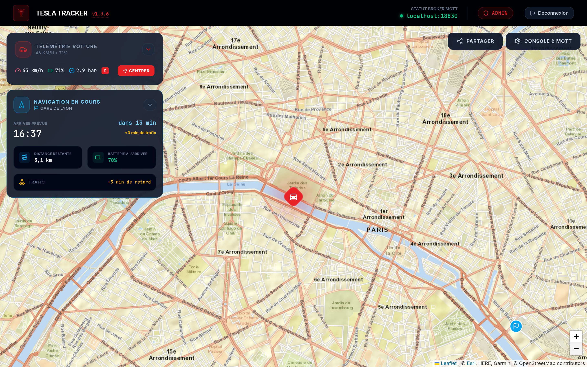
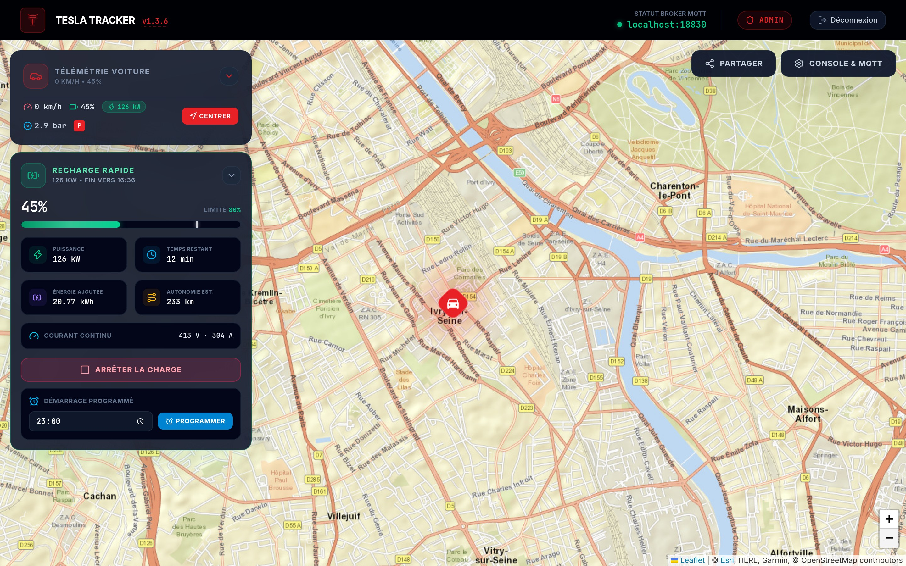
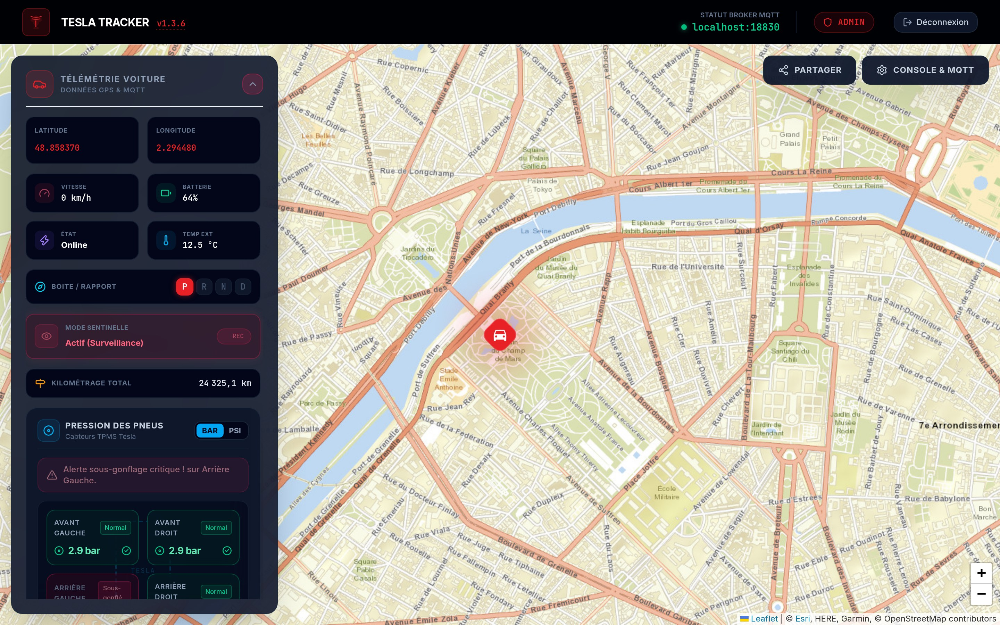
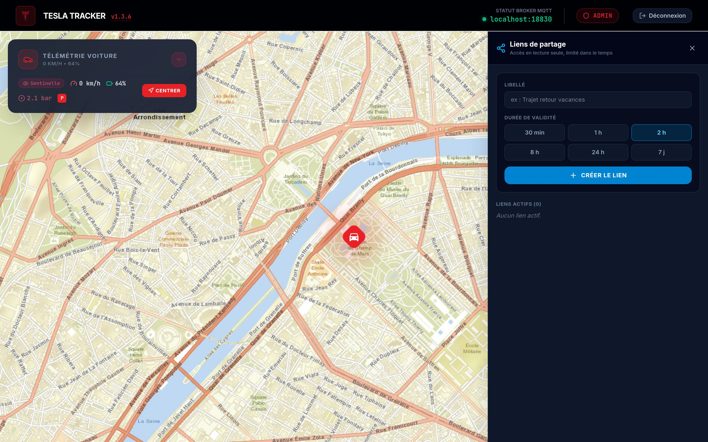
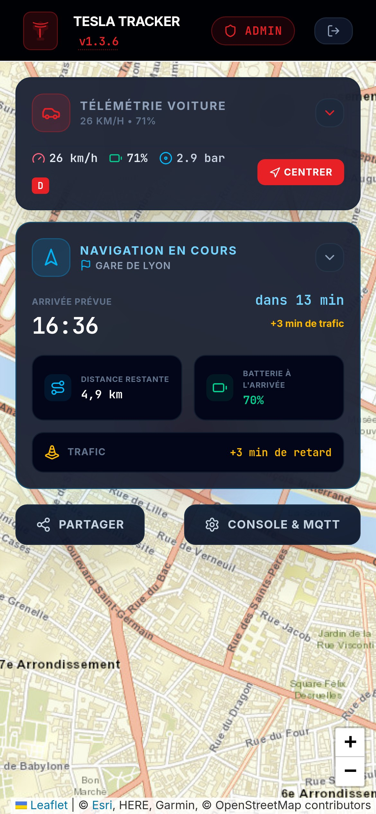
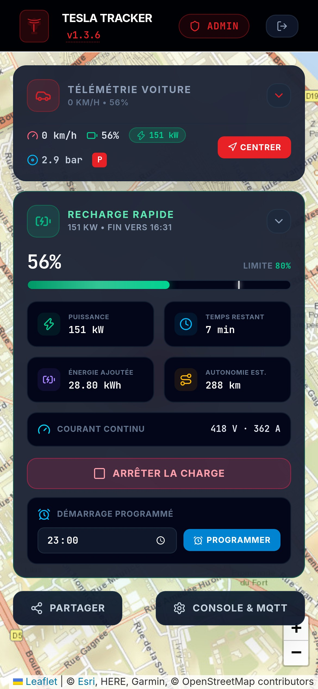

# Tesla Tracker 🚗📍

Application moderne de suivi et de géolocalisation de véhicule (Tesla) en temps réel, s'interfaçant avec **TeslaMate** via **MQTT**, avec une carte interactive (Leaflet), télémétrie en direct (SSE) et accès sécurisé par jeton.



## ✨ Fonctionnalités

- **Carte en direct** : position, vitesse, batterie, état, rapport engagé, température, kilométrage.
- **Navigation en cours** : destination, heure d'arrivée, temps et distance restants, batterie à l'arrivée, retard trafic.
- **Recharge** : puissance, heure de fin, énergie ajoutée, limite ; arrêt, démarrage et démarrage programmé via une intégration Tesla de Home Assistant.
- **Sentinelle et pneus** : état du mode Sentinelle, pression des 4 pneus avec alerte.
- **Liens de partage temporaires** en lecture seule, et **notifications Telegram**.

| Recharge | Télémétrie détaillée |
| --- | --- |
|  |  |

| Liens de partage | Mobile |
| --- | --- |
|  |   |

*Captures réalisées avec le mode démo (données fictives).*

---

## 🛠️ Prérequis

- **Mode Développement** : [Node.js](https://nodejs.org/) v24 (`nvm use` lit le fichier `.nvmrc`) et `npm`
- **Mode Docker / Production** : [Docker](https://docs.docker.com/get-docker/) et [Docker Compose](https://docs.docker.com/compose/install/)

---

## 🚀 Démarrage

### 1. Configurer l'environnement

Copiez le fichier d'exemple et remplissez-le avec vos identifiants MQTT et votre jeton de sécurité :
```bash
cp .env.example .env
```

Variables principales dans `.env` :
- `SECURE_ACCESS_TOKEN` : Jeton d'accès requis pour la carte (ex: `mon_token_secret`).
- `MQTT_BROKER_URL` : Adresse de votre broker MQTT (ex: `mqtt://192.168.1.100:1883`).
- `MQTT_USERNAME` & `MQTT_PASSWORD` : Identifiants de connexion MQTT.
- `MQTT_TOPIC` : Topic du composant GPS (ex: `teslamate/cars/1/location`).

---

### 💻 Mode Développement (Hot Reload en direct)

Idéal pour apporter des modifications au code source (`src/` ou `server.ts`) avec rechargement instantané sans recontruire de conteneur.

1. Installez les dépendances :
   ```bash
   npm install
   ```
2. Lancez le serveur de développement :
   ```bash
   npm run dev
   ```
3. Accédez à l'application : `http://localhost:3000`

---

### 🐳 Mode Docker (Production / Déploiement)

```bash
docker compose up --build -d
```

---

## 🏠 Add-on Home Assistant

Le dépôt est aussi un dépôt d'add-ons Home Assistant (`repository.yaml` + dossier `tesla-locator/`).

1. **Paramètres → Modules complémentaires → Boutique → ⋮ → Dépôts**, ajouter `https://github.com/florianfish/TeslaLocatorPG`.
2. Installer **Tesla Tracker**, renseigner l'onglet **Configuration** (équivalent du `.env` : broker, identifiants et topic MQTT, jetons), puis démarrer.
3. Optionnel : définir un port d'accès direct dans l'onglet **Réseau** (désactivé par défaut).

Depuis la barre latérale (Ingress), aucun jeton n'est demandé : l'authentification est assurée par Home Assistant. L'image (`amd64` / `aarch64`) est publiée sur GHCR par `.github/workflows/addon-image.yml` à chaque changement de `version` dans `tesla-locator/config.yaml`. Voir [tesla-locator/DOCS.md](tesla-locator/DOCS.md).

---

## 🔐 Sécurité & Jeton d'Accès

L'accès à l'application est protégé par les jetons `ADMIN_ACCESS_TOKEN` (accès complet) et `USER_ACCESS_TOKEN` (lecture seule) définis dans `.env`. En lecture seule, le serveur ne transmet que la position, la vitesse, la batterie, l'état et l'itinéraire (ni données MQTT brutes, ni adresse du broker, ni kilométrage, pneus ou Sentinelle).

Vous pouvez vous authentifier de deux manières :
1. **Sur l'écran d'accueil** : Saisissez simplement votre jeton dans le formulaire de connexion.
2. **Via l'URL** : Ajoutez le paramètre `token` dans votre navigateur :
   `http://localhost:3000/?token=VOTRE_TOKEN_ICI`

**Liens de partage temporaires** : un administrateur peut créer des liens en lecture seule à durée limitée via le bouton **Partager**, ou par l'API `POST /api/share-links` (en-tête `Authorization: Bearer <ADMIN_ACCESS_TOKEN>`), par exemple depuis Home Assistant. Définir `PUBLIC_URL` pour que les liens pointent vers l'adresse publique. Les liens sont stockés dans `./data` (volume Docker). Détails et exemple Home Assistant : [tesla-locator/DOCS.md](tesla-locator/DOCS.md#liens-de-partage-temporaires).

---

## 🔄 Mise à jour et Maintenance

- **Appliquer un changement de code en Docker** : `docker compose up --build -d`
- **Changement dans le fichier `.env`** : `docker compose restart`
- **Nettoyage des images Docker obsolètes** : `docker image prune -f`

---

## 📁 Structure du projet

- `server.ts` : Serveur Express + Proxy MQTT + Serveur d'événements SSE + Middleware Vite en dev.
- `src/` : Application React 19, Leaflet, Tailwind CSS & composants UI.
  - `src/App.tsx` : Composant principal (gestion auth, Leaflet map, flux SSE).
  - `src/components/` : Composants UI (`SecureLogin`, `MapOverlay`, `DebugPanel`).
- `docker-compose.yml` : Configuration Docker Compose.
- `Dockerfile` : Multi-stage build Node.js ultra-léger (Alpine).
- `AGENTS.md` : Guide d'architecture et consignes pour les agents IA.
